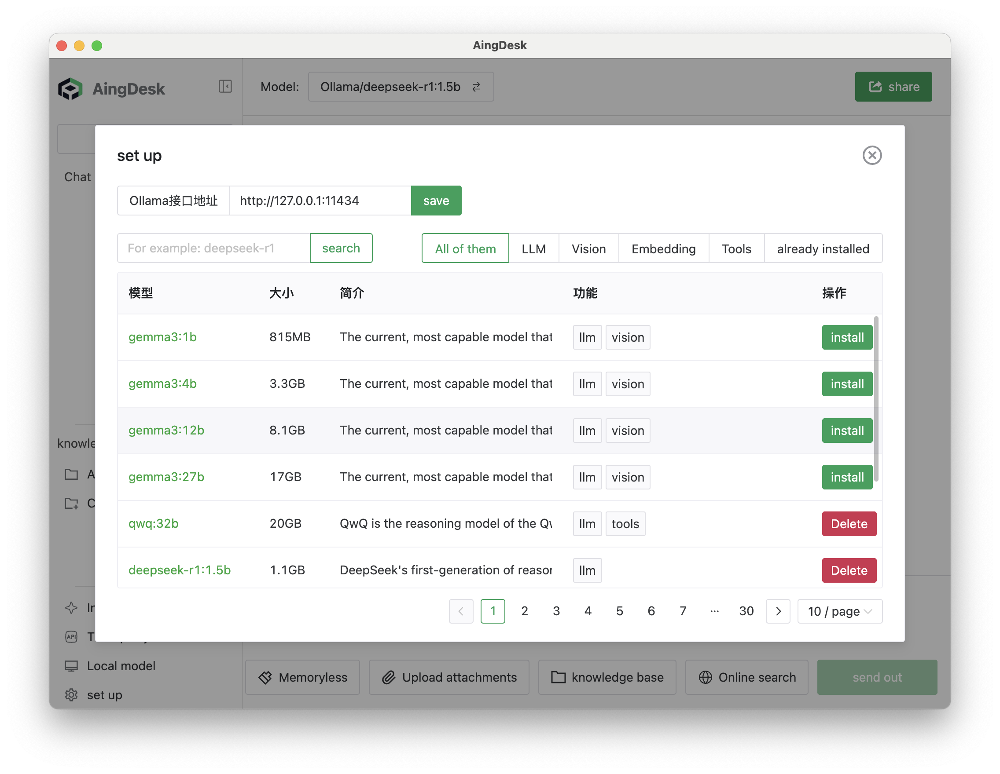
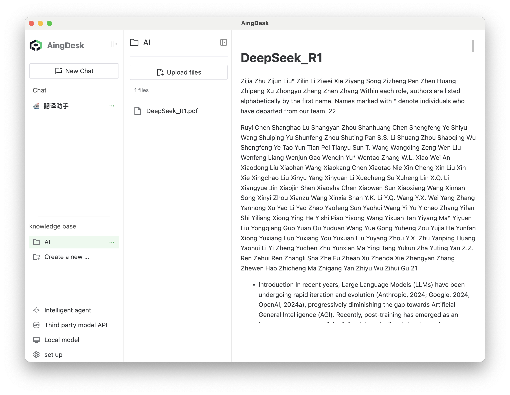
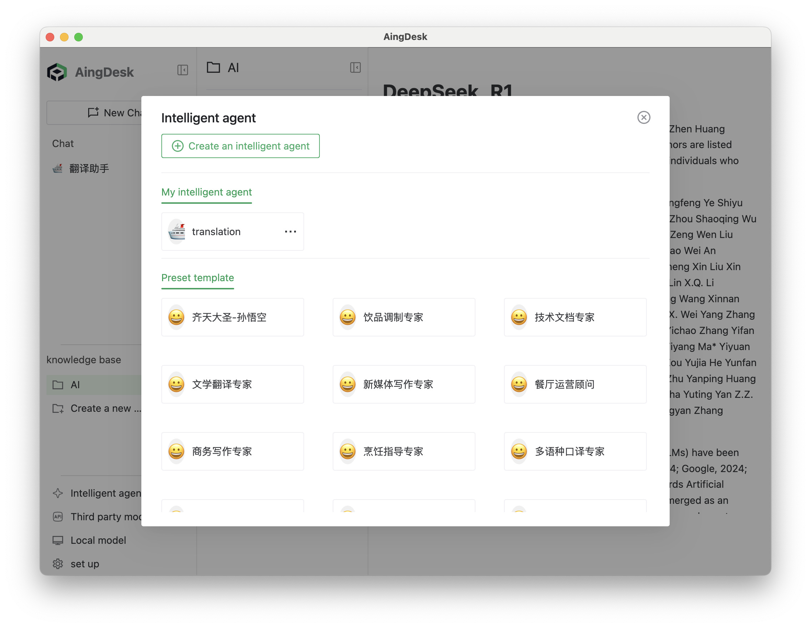
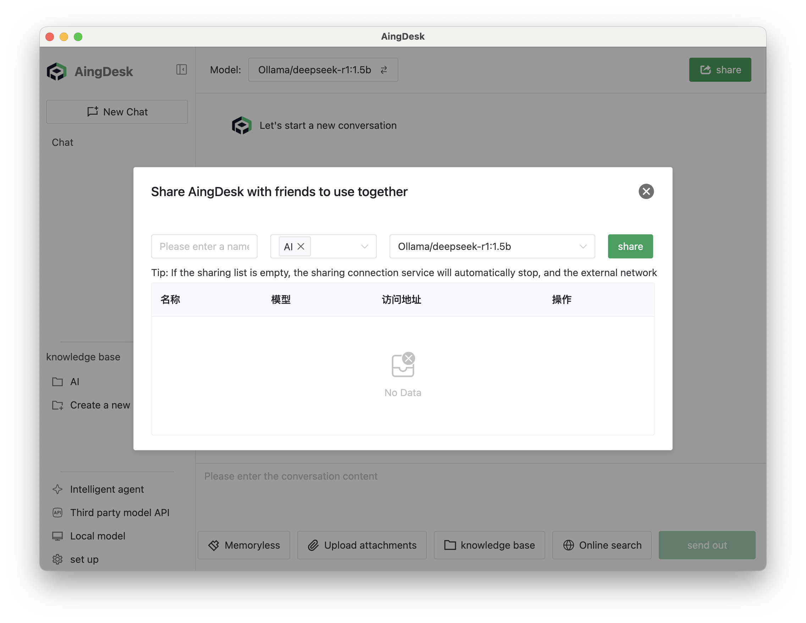
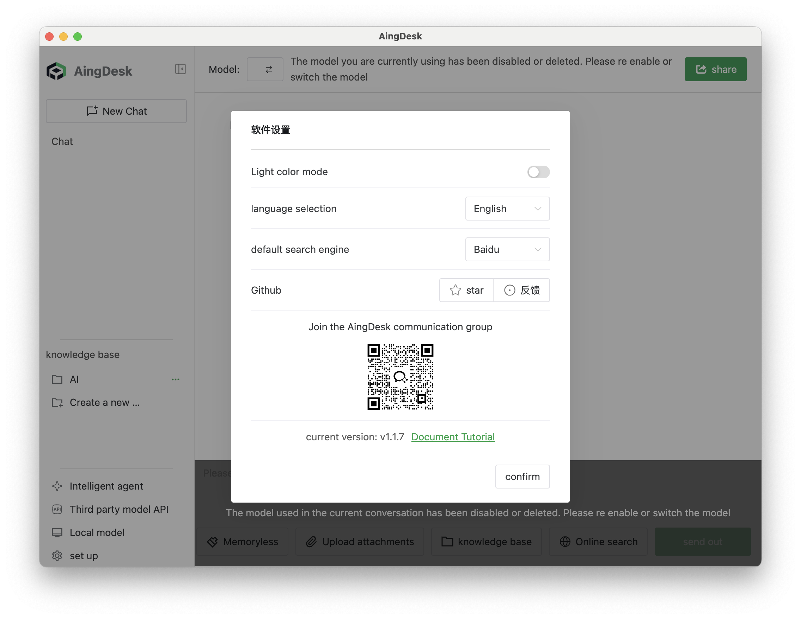
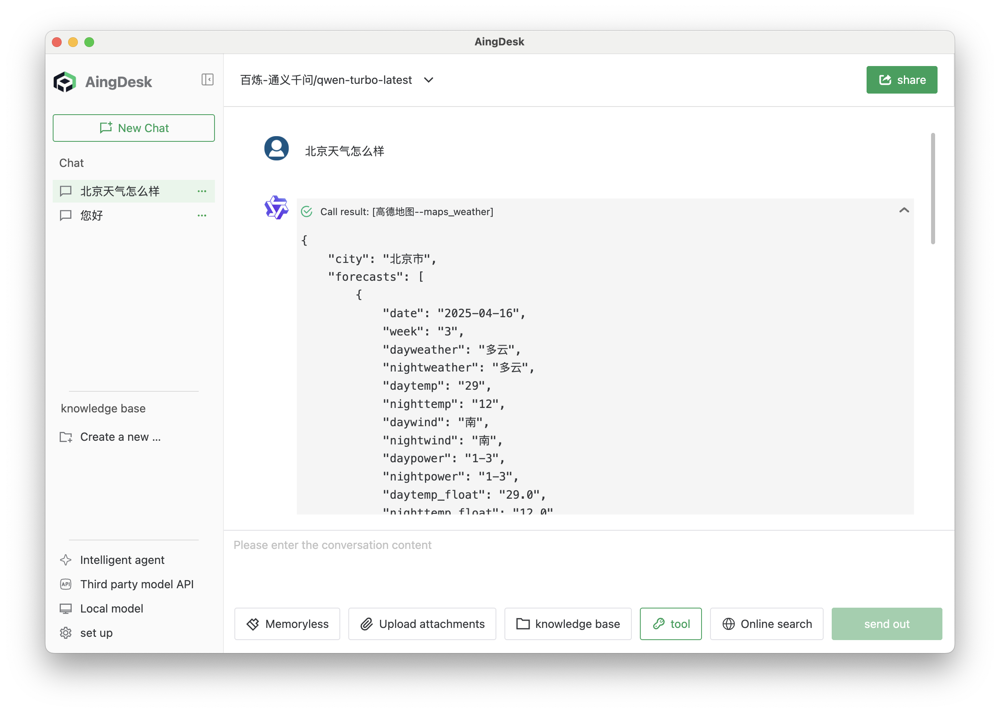

# aitodesk


[简体中文](README.zh_cn.md) | [Official Website](https://www.aitodesk.com/) | [Documentation](https://docs.aitodesk.com/)

aitodesk是一款简单好用的AI助手，支持知识库、模型API、分享、联网搜索、智能体，它还在飞快成长中。

aitodesk is an easy-to-use AI assistant that supports knowledge bases, model APIs, sharing, web search, and intelligent agents. It's rapidly growing and improving.

## 🚀 One-sentence Introduction  

A user-friendly AI assistant software that supports local AI models, APIs, and knowledge base setup.

## ✅ Core Features  

- One-click deployment of local AI models and mainstream model APIs

- Local knowledge base

- Intelligent agent creation

  
- Can be shared online for others to use


- Supports web search


- Supports server-side deployment 

- MCP Client


- Simultaneous conversations with multiple models in a single session (coming soon)  

## ✨ Product Highlights  
- Simple and easy to use, beginner-friendly for AI newcomers  

## 📥 Quick Installation

### Client Version（MacOS, Windows） 

- [Download from official website](https://www.aitodesk.com/)   
- [Download from CNB](https://cnb.cool/keyi898/AiToDesk/-/releases/)  
- [Download from Github](https://github.com/keyi898/AiToDesk/releases)  

### Server Version

#### Docker Run
```bash 
docker run -d \
  --name node \
  -v $(pwd)/data:/data \
  -v $(pwd)/uploads:/uploads \
  -v $(pwd)/logs:/logs \
  -v $(pwd)/bin:/aitodesk/bin \
  -v $(pwd)/sys_data:/sys_data \
  -p 7071:7071 \
  -w /aitodesk \
  keyi898/AiToDesk
```

#### Docker Compose
```bash
mkdir -p aitodesk
cd aitodesk
wget https://cnb.cool/keyi898/AiToDesk/-/git/raw/server/docker-compose.yml
# Run
docker compose up -d
# or
docker-compose up -d
``` 
## Build
```bash
git clone https://github.com/keyi898/AiToDesk.git
cd aitodesk
# For macOS users, please remove the `@rollup/rollup-win32-x64-msvc` dependency in [package.json](http://_vscodecontentref_/0)
cd frontend
yarn
cd ..
yarn
yarn dev
```

## Star History

[](https://www.star-history.com/#keyi898/AiToDesk&Date)

## Sponsor
- CDN acceleration and security protection for this project are sponsored by Tencent EdgeOne.
[](https://edgeone.ai/?from=github)
