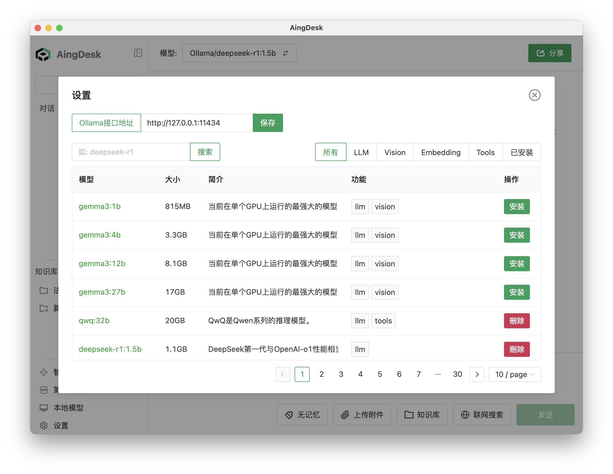
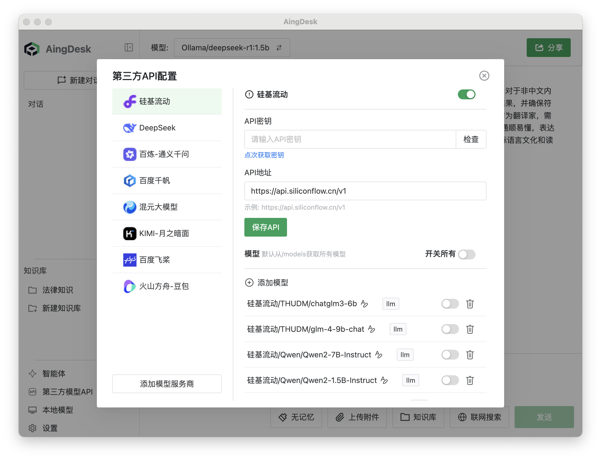
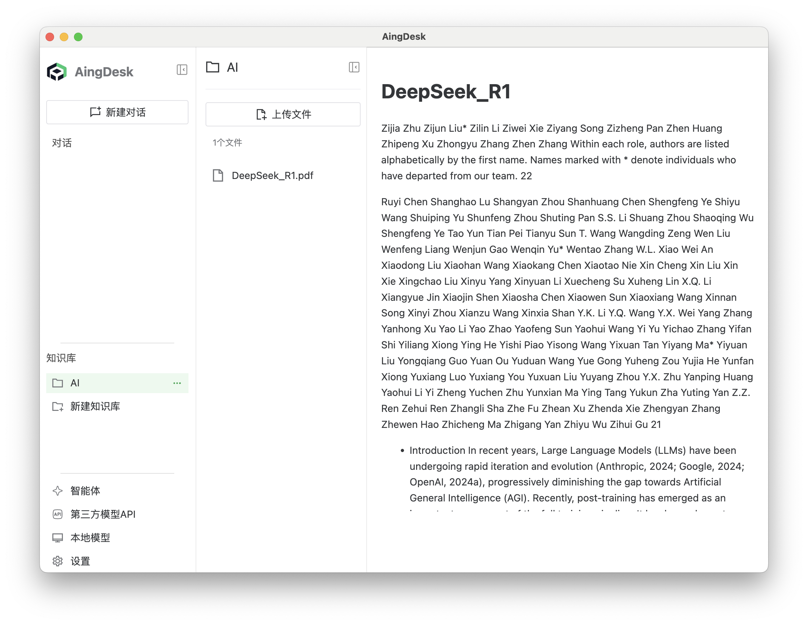
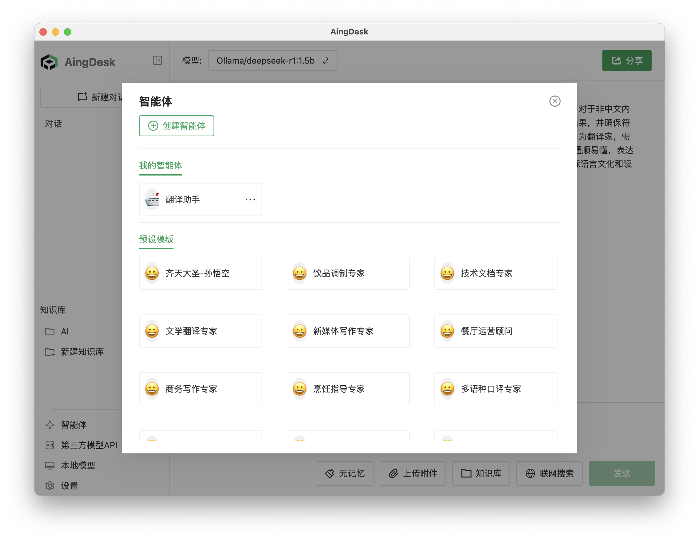
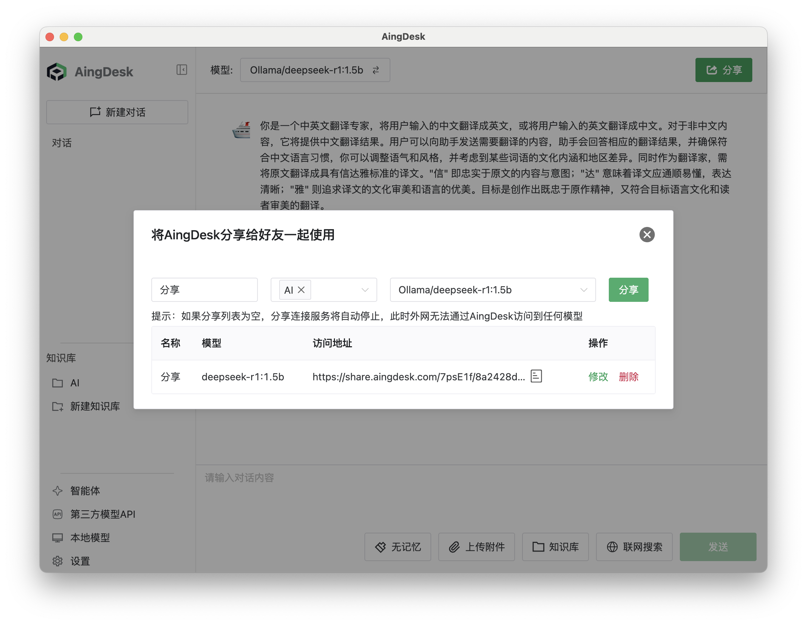
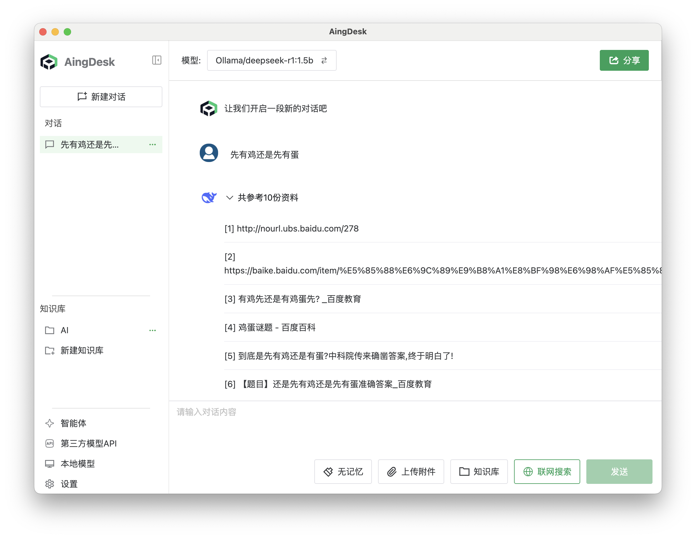

# aitodesk

[English](README.md)

aitodesk是一款简单好用的AI助手，支持知识库、模型API、分享、联网搜索、智能体，它还在飞快成长中。

## 🚀一句话简介

简单好用的AI助手软件，支持本地AI模型及API+知识库搭建。

## ✅核心功能

- 一键部署本地AI模型及主流模型API



- 本地知识库


- 智能体创建


- 可在线分享给他人使用


- 支持联网搜索


- 支持服务器端部署
- 单次多模型同时对话（即将上线） 

## ✨产品亮点

- 简单好用，对AI新手友好

## 📥快速安装

### 客户端版本（MacOS, Windows）
- [官网下载](https://www.aitodesk.com/)   
- [从 CNB 下载](https://cnb.cool/keyi898/AiToDesk/-/releases/) 
- [从 Github 下载](https://github.com/keyi898/AiToDesk/releases)  

### 服务器端版本
#### Docker Run
```bash 
docker run -d \
  --name node \
  -v $(pwd)/data:/data \
  -v $(pwd)/uploads:/uploads \
  -v $(pwd)/logs:/logs \
  -v $(pwd)/bin:/aitodesk/bin \
  -v $(pwd)/sys_data:/sys_data \
  -p 7071:7071 \
  -w /aitodesk \
  keyi898/AiToDesk
```

#### Docker Compose
```bash
mkdir -p aitodesk
cd aitodesk
wget https://cnb.cool/keyi898/AiToDesk/-/git/raw/server/docker-compose.yml
# Run
docker compose up -d
# or
docker-compose up -d
```

## 编译
```bash
git clone https://github.com/keyi898/AiToDesk.git
cd aitodesk
# macOS用户请删除frontend/package.json中的`@rollup/rollup-win32-x64-msvc`依赖
cd frontend
yarn
cd ..
yarn
yarn dev
```